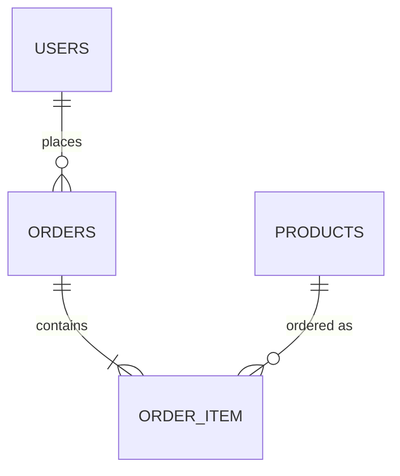

# Cacao Co Backend (Spring Boot)

REST API for the Cacao Co chocolate e-commerce platform. It provides authentication with JWT, product management, order placement with stock control, and order status management for administrators.


---

## Tech stack

| Area | Technology |
|---|---|
| Language | Java 25 |
| Framework | Spring Boot 4.1.1 (Spring Web MVC) |
| Persistence | Spring Data JPA, Hibernate |
| Database | PostgreSQL |
| Security | Spring Security, JWT (jjwt 0.12.6), BCrypt |
| Validation | Jakarta Bean Validation (`spring-boot-starter-validation`) |
| Utilities | Lombok |
| Build | Maven (wrapper included: `mvnw`, `mvnw.cmd`) |

---

## Project structure

Base package: `com.ecommerce.cacao`

```
src/main/java/com/ecommerce/cacao/
├── CacaoApplication.java
├── config/
│   ├── SecurityConfig.java       filter chain, route rules, CORS, 401/403 JSON handlers
│   ├── PasswordConfig.java       BCrypt password encoder bean
│   └── AdminSeeder.java          creates the admin account on first start
├── contoller/                    (sic) REST controllers
│   ├── AuthController.java       /api/auth
│   ├── ProductController.java    /api/products
│   └── OrderController.java      /api/orders
├── dto/                          LoginRequest, RegisterRequest, AuthResponse, OrderRequest, OrderItemRequest
├── entity/                       User, Product, Order, OrderItem + enums UserRole, ProductCategory, OrderStatus
├── exception/                    ResourceNotFoundException, InsufficientStockException,
│                                 GlobalExceptionHandler, AuthExceptionHandler
├── repository/                   UserRepository, ProductRepository, OrderRepository
├── security/                     JwtService, JwtAuthenticationFilter, CustomUserDetailsService
└── service/                      AuthService, ProductService, OrderService
```

Request flow: `JwtAuthenticationFilter` → `SecurityFilterChain` → Controller → Service → Repository → PostgreSQL.

---

## Getting started

### Prerequisites

- JDK 25
- PostgreSQL with an empty database named `ecommerce`

```sql
CREATE DATABASE ecommerce;
```

### Configure

Settings are in `src/main/resources/application.properties`:

| Property | Meaning |
|---|---|
| `server.port` | HTTP port (8080) |
| `spring.datasource.url` | `jdbc:postgresql://localhost:5432/ecommerce` |
| `spring.datasource.username`, `spring.datasource.password` | PostgreSQL credentials |
| `spring.jpa.hibernate.ddl-auto` | `update`: tables are created and adjusted automatically (fine for development) |
| `spring.jpa.show-sql`, `...format_sql` | Print formatted SQL in the console |
| `jwt.secret` | Signing key. **Must be at least 32 characters**, otherwise the app refuses to start |
| `jwt.expiration` | Token lifetime in milliseconds (`86400000` = 24 hours) |
| `admin.email`, `admin.password` | Credentials of the admin account created on first start |

Any property can be overridden with an environment variable, for example:

```bash
export SPRING_DATASOURCE_PASSWORD=...
export JWT_SECRET=...
export ADMIN_PASSWORD=...
```
```
# ============================================================
# Cacao Co backend: example configuration
#
# HOW TO USE
#   1. Copy this file to application.properties
#        (same folder: src/main/resources/)
#   2. Replace every <placeholder> with your own value
#   3. Never commit application.properties (it is git-ignored)
#
# Any property can also be set with an environment variable,
# for example SPRING_DATASOURCE_PASSWORD, JWT_SECRET, ADMIN_PASSWORD.
# ============================================================

spring.application.name=cacao

server.port=8080

# ------------------------------------------------------------
# DATABASE - POSTGRESQL
# Create the database first:  CREATE DATABASE ecommerce;
# ------------------------------------------------------------
spring.datasource.url=jdbc:postgresql://localhost:5432/ecommerce
spring.datasource.username=<your_postgres_username>
spring.datasource.password=<your_postgres_password>

# ------------------------------------------------------------
# JPA / HIBERNATE
# "update" creates and adjusts tables automatically.
# Fine for development. For production use "validate" or "none"
# together with database migrations.
# ------------------------------------------------------------
spring.jpa.hibernate.ddl-auto=update
spring.jpa.show-sql=true
spring.jpa.properties.hibernate.format_sql=true

# ------------------------------------------------------------
# DATABASE INITIALIZATION
# ------------------------------------------------------------
spring.jpa.defer-datasource-initialization=true

# ------------------------------------------------------------
# JWT
# jwt.secret must be at least 32 characters, otherwise the
# application refuses to start.
# Generate a strong one with:   openssl rand -base64 48
# jwt.expiration is in milliseconds (86400000 = 24 hours).
# ------------------------------------------------------------
jwt.secret=<long_random_secret_at_least_32_characters>
jwt.expiration=86400000

# ------------------------------------------------------------
# ADMIN ACCOUNT
# Created automatically on first start if the email does not
# exist yet. Use a strong password and change it after login.
# ------------------------------------------------------------
admin.email=<admin_email>
admin.password=<strong_admin_password>
```

### Run

```bash
./mvnw spring-boot:run        # Windows: mvnw.cmd spring-boot:run
```

On first start the console prints "Cacao admin account created successfully".

### Test

```bash
./mvnw test
```

Currently there is only the default `CacaoApplicationTests` context-load test.

### Build

```bash
./mvnw clean package
java -jar target/cacao-0.0.1-SNAPSHOT.jar
```

---

## API reference

Base URL: `http://localhost:8080/api`. Send the token as `Authorization: Bearer <token>` on protected endpoints.

### Authentication

| Method | Endpoint | Access | Description |
|---|---|---|---|
| POST | `/auth/register` | Public | Create a `CUSTOMER` account and return a token |
| POST | `/auth/login` | Public | Log in and return a token |
| GET | `/auth/me` | Logged in | Current user (token is not re-issued) |

Register request:

```json
{ "name": "Asha", "email": "asha@example.com", "password": "secret123" }
```

Rules: name required (max 100), valid email (max 150), password 6 to 100 characters. A duplicate email returns 400.

Login request: `{ "email": "...", "password": "..." }`

Auth response (register and login):

```json
{ "token": "<jwt>", "userId": 3, "name": "Asha", "email": "asha@example.com", "role": "CUSTOMER" }
```

### Products

| Method | Endpoint | Access | Description |
|---|---|---|---|
| GET | `/products` | Public | List all products |
| GET | `/products/{id}` | Public | One product (404 if missing) |
| GET | `/products/category/{category}` | Public | Products of a category (see known issues) |
| POST | `/products` | ADMIN | Create a product |
| PUT | `/products/{id}` | ADMIN | Update a product |
| DELETE | `/products/{id}` | ADMIN | Delete a product (204) |

Product body:

```json
{
  "name": "Ecuador 72% Dark Chocolate",
  "category": "DARK_CHOCOLATE",
  "price": 899.00,
  "stock": 24,
  "image": "data:image/png;base64,... or a URL",
  "isNew": true
}
```

Validation: name required, category required, price at least 0.01, stock at least 0, image required. Categories: `DARK_CHOCOLATE`, `MILK_CHOCOLATE`, `SINGLE_ORIGIN`, `GIFT_COLLECTION`.

### Orders

| Method | Endpoint | Access | Description |
|---|---|---|---|
| POST | `/orders` | CUSTOMER, ADMIN | Place an order |
| GET | `/orders/my` | CUSTOMER, ADMIN | Orders of the logged-in user, newest first |
| GET | `/orders` | ADMIN | All orders, newest first |
| GET | `/orders/{id}` | ADMIN | One order |
| PUT | `/orders/{id}/status?status=SHIPPED` | ADMIN | Change order status |

Place order request (no prices are sent; the server uses stored prices):

```json
{
  "customerName": "Asha",
  "email": "asha@example.com",
  "phone": "9876543210",
  "address": "12 Main Street, Vadodara, 390001",
  "items": [
    { "productId": 1, "quantity": 2 },
    { "productId": 4, "quantity": 1 }
  ]
}
```

Statuses: `PENDING` (default), `CONFIRMED`, `PROCESSING`, `SHIPPED`, `DELIVERED`, `CANCELLED`.

### Error format

```json
{ "status": 409, "message": "Not enough stock for product: Amazonia Single Origin", "timestamp": "2026-10-06T10:15:30" }
```

| Status | When |
|---|---|
| 400 | Validation failed (`errors` map of field to message), unreadable body, duplicate email |
| 401 | Missing, invalid or expired token: `{ "status": 401, "message": "Authentication required" }` |
| 403 | Role not allowed: `{ "status": 403, "message": "You do not have permission to perform this action" }` |
| 404 | Product, order or user not found |
| 409 | Insufficient stock |
| 500 | Unexpected error (the message contains the root cause) |

---

## Data model



| Table | Columns |
|---|---|
| `users` | id, name, email (unique), password (BCrypt hash), role (`CUSTOMER` or `ADMIN`), created_at |
| `products` | id, name, category, price `DECIMAL(10,2)`, stock, image `TEXT`, is_new |
| `orders` | id, user_id, customer_name, email, phone, address, subtotal_amount, shipping_amount, total_amount (all `DECIMAL(12,2)`), status, created_at |
| `order_item` | id, order_id, product_id, product_name, price, quantity, subtotal |

`order_item` stores a copy of the product name and price at the time of purchase, so old orders do not change when a product is edited.

---

## Business rules

- **Shipping:** free when the subtotal is ₹2,500 or more, otherwise ₹150 (`OrderService` constants).
- **Total** = subtotal + shipping, calculated on the server with `BigDecimal`.
- **Stock:** checked per item inside one `@Transactional` method. If any item is short, the whole order fails with 409 and nothing is saved. On success, stock is reduced.
- **Ownership:** an order is linked to the logged-in user by the email in the token.
- **Registration** can only create customers. The admin is created by `AdminSeeder` if no account with `admin.email` exists.

---

## Security

- Stateless sessions, CSRF disabled (token based API).
- Passwords hashed with BCrypt. Tokens signed with HMAC (HS256 key from `jwt.secret`), subject is the user's email.
- Route rules are in `SecurityConfig`. Public: register, login, `GET /products/**`, `/error`, CORS preflight. Everything else requires a valid token, with ADMIN-only rules for product writes, listing all orders, reading an order by id, and status updates.
- CORS allows `http://localhost:5173` only (set in `SecurityConfig` and again with `@CrossOrigin` on each controller).

---

## Known issues and suggested fixes

| Issue | Where | Suggested fix |
|---|---|---|
| Category is never updated when editing a product | `ProductService.updateProduct` calls `getCategory(...)` | Call `existingProduct.setCategory(updatedProduct.getCategory())` and remove the odd `getCategory(ProductCategory)` overload in `Product` |
| Category endpoint likely fails | `ProductRepository.findByCategory(String)` while the field is an enum | Change to `findByCategory(ProductCategory category)` and convert the path variable |
| Stock can be oversold under concurrency | `OrderService.createOrder` | Lock product rows (`@Lock(PESSIMISTIC_WRITE)`) or add a `@Version` column |
| Stock not restored on cancellation | `OrderService.updateStatus` | Return stock when the status becomes `CANCELLED`, and validate status transitions |
| Orders expose entities (including product images) | `OrderController` | Return an `OrderResponse` DTO |
| Images stored as base64 in the database | `Product.image` | Store files elsewhere and keep a URL |
| Debug `System.out.println` calls and detailed 500 messages | `JwtAuthenticationFilter`, `JwtService`, `GlobalExceptionHandler` | Use a logger and return a generic message to clients |
| Secrets in `application.properties` | `src/main/resources` | Environment variables or a git-ignored profile file |
| Package name typo | `contoller` | Rename to `controller` |
| Hard-coded CORS origin | `SecurityConfig`, controllers | One configurable property, remove per-controller `@CrossOrigin` |
| Almost no tests | `src/test` | Add service tests (Mockito) for order creation and stock rules, and controller tests with MockMvc |

---

## Troubleshooting

| Problem | Likely cause |
|---|---|
| Fails to start with a connection error | PostgreSQL not running, or wrong URL, username or password |
| `JWT secret must contain at least 32 characters` | `jwt.secret` is too short |
| Browser shows a CORS error | Frontend is not running on `http://localhost:5173` |
| 401 on a protected call | Token missing, expired (24 h) or the user no longer exists |
| 403 on an admin call | Logged in as a customer |
| 409 when ordering | A product has less stock than requested |
